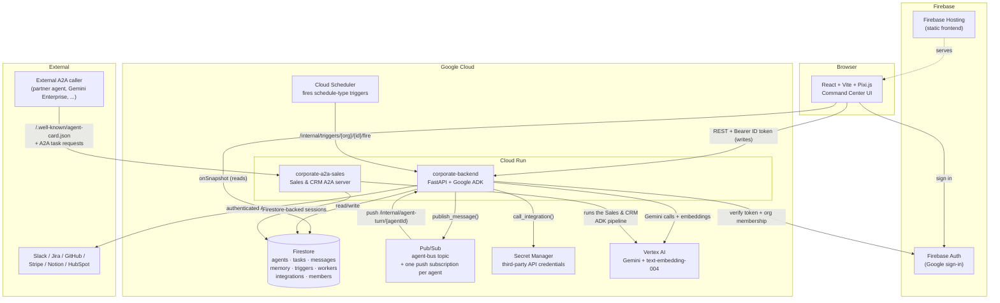

# Architecture

Corporate is a hosted, cloud-native multi-agent web app: a 2D office-floor UI where department agent teams work under a CEO orchestrator. This document is the submission-facing architecture reference — see `/docs/system_prompt.md` for the engineering rules and `/docs/adr/` for the reasoning behind each decision below.

## System diagram

## Components

| Component | Role |
|---|---|
| **Frontend** (`/frontend`) | React + Vite + TS. Pixi.js renders the office floor (department zones, agent status dots); every Command Center tab (Monitor, Tasks, Ask-me, Activity, Triggers, Workers, Memory, Graph) is a thin view over one Firestore collection, read via `onSnapshot`. Mutations go through `platformClient.ts`'s REST client, which attaches the signed-in user's Firebase ID token. |
| **Backend** (`/backend`) | Python 3.12, FastAPI, Google ADK 2.7.1. Hosts the CEO agent, all 9 department pipelines, the Pub/Sub messaging chokepoint, the Firestore-backed ADK session service, the integration broker, and every `/api/org/{org_id}/*` + `/internal/*` route. |
| **Standalone A2A server** (`app/a2a_server.py`) | A second Cloud Run service exposing the Sales & CRM department's ADK agent tree over the A2A protocol at its own `/.well-known/agent-card.json` — deliberately separate from the main backend so that well-known route sits at the service's own root, per the A2A spec (ADR-0004). |
| **Firestore** | All durable state, namespaced `orgs/{orgId}/...`: agents, tasks, messages (Pub/Sub mirror), per-agent memory (with embeddings), activity log, triggers, workers, integrations, members, audit log. |
| **Pub/Sub** | A single `agent-bus` topic; one push subscription per agent, filtered by `to` attribute. `publish_message()` is the sole chokepoint for hop-count/loop prevention and `requires_reply` derivation (ADR-0003). |
| **Vertex AI** | Gemini (`gemini-2.5-flash` by default, configurable) for every department's reasoning, and `text-embedding-004` for semantic memory search. |
| **Secret Manager** | The only place a third-party credential (Slack token, Stripe key, etc.) exists as plaintext — dereferenced exclusively by `integration_broker.py`. |
| **Cloud Scheduler** | Fires schedule-type triggers by calling `/internal/triggers/{org_id}/{trigger_id}/fire`. |
| **Firebase Auth + Hosting** | Google sign-in for end users; static hosting for the built frontend, with rewrites to the Cloud Run backend for `/api/**` and `/internal/**`. |

## The department layer

Every department is a Python package implementing one contract (`DepartmentSpec` + an `on_task_received(org_id, task) -> TaskResult` function, wrapped with `@audited_task` for automatic hash-chained audit logging and task-status/reply writeback — see ADR-0005). Nine departments are implemented:

| Department | Pattern |
|---|---|
| Finance & Audit | 5-stage pipeline; two-stage Gemini-only fraud detection (deterministic signals → isolated LLM risk assessment, ADR-0006) |
| Engineering & SRE | Triage → cascade-risk → postmortem draft; PII redacted before any LLM call; Slack-notifies on high severity |
| Legal & Risk | 5 parallel judge lenses → deterministic quote-grounding (ADR-0007) — an ungrounded claim is dropped, never surfaced |
| Office of the CEO | Cross-department digest, reads real Firestore task/agent counts |
| Sales & CRM | The one real `SequentialAgent` composition (ADR-0009) with a hard-capped `pricing_guardrail` tool; exposed externally over A2A |
| HR & People Ops | Classify → handbook Q&A; leave requests always need human approval by design |
| Customer Support | Classify → KB-grounded reply → deterministic grounding check (third reuse of the ADR-0007 pattern) |
| Marketing & Comms | Brief → copy → deterministic brand-voice checkers (`vote_aspects`) → scheduling suggestion |
| Product & Data Analytics | Metrics Q&A grounded in real Firestore counts; chart specs built in Python, never LLM-generated |

Two shared, cross-cutting utilities back several of these: `shared/audit_chain.py` (tamper-evident hash chain, applied to every task automatically) and `shared/verification.py` (`ground_quote`/`vote_aspects`, reused by Finance, Legal, Support, and Marketing rather than each department growing its own copy).

## Security model ("Fortified Enterprise Fleet")

- **Defense in depth on auth** (ADR-0010): Firestore Security Rules gate direct client reads by org membership; the backend independently re-checks membership on every `/api/org/{org_id}/*` route via a router-level dependency, since the backend's own service-account writes aren't subject to client-facing Firestore rules.
- **Secrets isolation**: the integration broker is the only code path that ever holds a real third-party credential; setup is write-only (a raw secret value is accepted exactly once, written straight to Secret Manager, and never echoed back or persisted in Firestore).
- **Tamper-evident audit trail**: every department task write is hash-chained automatically; `/api/org/{org_id}/audit/verify` replays the chain to detect any single-entry tampering.
- **A2A used narrowly** (ADR-0004): the external attack surface (Sales & CRM's A2A endpoint) is a separate, deliberately isolated service from the internal Pub/Sub fabric — internal messaging never crosses that boundary.
- **Mechanism, not LLM judgment**, for anything security- or loop-relevant: hop-cap and reply-obligation derivation in `publish_message()`, the `pricing_guardrail` hard cap, and Slack notification triggering are all deterministic Python, never something an LLM decides on its own.

## What's not yet deployed

As of this document, the system has not been deployed against a live GCP project (billing was pending on the available accounts during development) — every claim above is backed by 68 passing backend tests that mock Firestore/Pub-Sub/Gemini/Secret Manager, plus a live HTTP round-trip test against the A2A server's Agent Card endpoint. See `/infra/deploy/setup.sh` and `/infra/deploy/deploy.sh` for the exact commands that will stand this up once billing clears.
