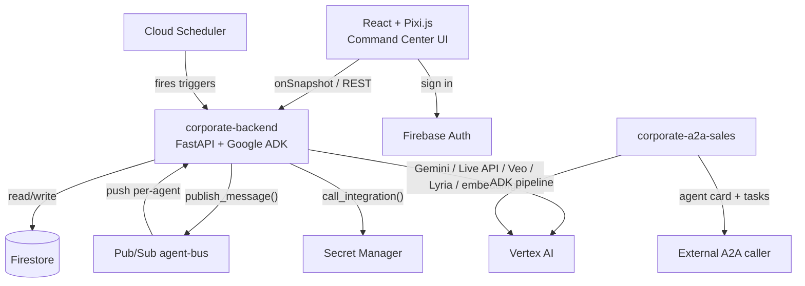

# Corporate — hackathon submission

Built for **All Things Agentic**, track: **The Fortified Enterprise Fleet**.

## Elevator pitch

A virtual company that actually runs itself: nine autonomous AI departments — Finance, Engineering, Legal, Sales, HR, Support, Marketing, Analytics, and a CEO who delegates to all of them — working on a live 2D office floor you can watch, join by voice, and audit down to the hash chain.

## Project story

### Inspiration

The Fortified Enterprise Fleet track asks for scalable institutional agent networks with real discovery/lifecycle, execution/state, security/governance, and telemetry — not a chatbot demo. A department roster of specialized agents reporting to a CEO orchestrator was the natural shape for that: it's how a real company is already organized, so "cross-department deployment" and "governance" aren't abstractions bolted on afterward, they're the org chart. Office-style AI agents were an inspiration for making that org chart feel alive rather than like a dashboard.

### What it does

Sign in, dispatch a goal to the CEO agent, and watch it get decomposed into real tasks routed to the department best suited for each one — over an actual Pub/Sub message bus, not an in-process function call. Each department runs its own multi-stage ADK pipeline (triage → risk assessment → explanation for Finance; classify → cascade-risk → postmortem for Engineering; brief → copy → brand-voice review for Marketing; and so on), with claims verified by deterministic quote-grounding or independent cross-model review before they're ever surfaced. A Command Center dashboard (Monitor, Tasks, Ask-me, Activity, Triggers, Workers, Memory, Knowledge, Board, Graph, Settings, Commands) gives full visibility into every agent's status, mood, memory, message graph, and the tamper-evident audit chain behind every task. Agents have real personas (name, bio, voice, sprite), can talk to the CEO by realtime voice, generate promo videos (Veo) and break-room music (Lyria), and propose their own skills for a human to approve.

### How we built it

Python 3.12 + FastAPI + Google ADK 2.7.1 on the backend, one department contract (`DepartmentSpec` + `on_task_received`) every department implements identically; React + Vite + TypeScript + Pixi.js on the frontend, reading Firestore directly via `onSnapshot` and writing through a thin REST client. Firestore holds all durable state (namespaced `orgs/{orgId}/...` from day one — multi-tenant even with only one org seeded); Pub/Sub carries every inter-agent message through one chokepoint function that owns loop-prevention and reply-obligation derivation; Cloud Run hosts both the main backend and a second, deliberately separate A2A server exposing Sales & CRM externally. Every non-obvious decision has an ADR in `/docs/adr/` (20 so far) — the discipline that made a 3-day pre-deadline audit (see below) tractable instead of terrifying.

### Challenges we ran into

- **Gemma turned out to be unreachable** in this project's Vertex AI access at any tier — live-testing (not trusting Model Garden's docs) found every variant showed a paid "Deploy model" button, never the zero-deployment path we'd assumed. Swapped for a distinct Gemini tier instead of burning deadline time on a GPU endpoint for one checker.
- **A hard eligibility gap found three days before the deadline**: the hackathon requires Gemini 3.5+; this project was on 2.5-tier models. Fixing it needed real investigation, not a docs lookup — the new models only work at Vertex's `global` location, which meant reading ADK's own installed source to confirm it already resolves there by default whenever `GOOGLE_CLOUD_LOCATION` is unset. Zero location config change needed, once we knew that.
- **A silent production bug, found while auditing observability, not reported by anyone**: every ephemeral worker had been failing on its very first turn since the feature shipped — a Firestore `.update()` call assumed a document existed that never did. Reproduced live against real Firestore both ways before shipping the one-line fix.
- **Antigravity, evaluated and rejected** (ADR-0014): no persistence model that survives Cloud Run's ephemeral, scale-to-zero instances, and its practical headless auth path conflicts with the Vertex-AI-only eligibility requirement.

### Accomplishments that we're proud of

A dispatch path that's idempotent and fails closed by construction (a redelivered Pub/Sub message is a logged no-op; a department exception always becomes a blocked task with a human question, never a crash or a silent stall) — not bolted on, but the actual contract every department gets for free. A tamper-evident, hash-chained audit log with a live integrity badge. Defense-in-depth auth (Firestore Security Rules and an independent backend membership check, because the backend's own elevated writes aren't subject to the client-facing rules). Catching and fixing a real, previously-invisible production bug during a routine observability audit rather than shipping past it.

### What we learned

Docs and even a package's own docstrings lag reality — Gemma's Model Garden card, this project's own stale "not yet deployed" architecture doc, and a Live API model that quietly 404'd in production all needed a real API call to catch, not a careful read. The fix, every time, was the same: verify live against the actual deployed system before writing a line of config, and write down what you found even when it's a correction to your own earlier decision.

### What's next for Corporate

The `SequentialAgent`→ADK `Workflow` migration (deferred once already, ADR-0009); real Cloud Run Job execution for ephemeral workers instead of in-process `asyncio` tasks; retry-with-backoff for transient Gemini errors; self-service org invites; routing realtime voice through `Runner.run_live` so a spoken request can actually call `create_task`, not just talk.

## Built with

`python`, `fastapi`, `google-adk`, `google-genai`, `gemini-3.5-flash`, `gemini-3.1-pro-preview`, `vertex-ai`, `firestore`, `pub-sub`, `cloud-run`, `cloud-scheduler`, `secret-manager`, `firebase-auth`, `firebase-hosting`, `react`, `vite`, `typescript`, `pixi.js`, `xterm.js`, `veo`, `lyria`, `text-embedding-004`, `a2a-protocol`, `restrictedpython`, `pydantic`, `websockets`

## Try it out

- **Live app**: https://project-f0b6b4ce-541f-43ff-9f7.web.app
- **Backend health**: https://corporate-backend-2wv6ilt7fa-uc.a.run.app/api/healthz
- **Sales & CRM A2A agent card**: https://corporate-a2a-sales-2wv6ilt7fa-uc.a.run.app/.well-known/agent-card.json
- **Source**: this repository (shared with `testing@devpost.com` and `cloudhackathons@google.com` per submission requirements)

## Detailed testing instructions

**Try it live** (fastest path): open the live app URL above, sign in with Google, and:
1. Watch the office floor — agents idle, then animate (thinking/working/blocked dots) as they get work.
2. Go to **Tasks**, or just wait — the seeded org has departments ready to receive work. Dispatch a goal through the CEO (via the Terminal in the CEO's Agent Detail view, or a Trigger).
3. Watch **Activity** for the live audit-chain integrity badge, **Ask-me** for any human-in-the-loop questions a department raises, **Graph** for the live agent-to-agent message graph, **Workers** to spawn an ephemeral one-off worker and watch its real execution trace, and **Board** for the CEO's shared company blackboard.
4. Open a department's Agent Detail view for its persona, voice, current goal, model tier, and skills (built-in, AI-proposed pending your approval, and custom).
5. Try the mic icon for a realtime voice conversation with the CEO.

**Run it locally**:
```bash
# Backend
cd backend
python -m venv .venv && .venv/Scripts/activate  # .venv/bin/activate on macOS/Linux
pip install -r requirements.txt
cp .env.example .env  # fill in your GCP project id
python scripts/seed.py --owner-uid <your-firebase-uid>
uvicorn app.main:app --reload --env-file .env

# Frontend
cd frontend
npm install
cp .env.example .env  # fill in your Firebase web app config
npm run dev
```

**Run the test suite** (no live GCP credentials needed — everything mocks Firestore/Pub-Sub/Gemini/Secret Manager):
```bash
cd backend && pytest -q          # 228+ tests
cd frontend && npm run build && npm run lint
```

Full setup detail, including Pub/Sub push-subscription setup and A2A server deployment, is in `README.md`.

## Which Google SDK did you use?

**Agent Development Kit (ADK)** (`google-adk==2.7.1`) — every agent in this project is an ADK `LlmAgent`/`SequentialAgent`/`ParallelAgent`, built by one factory module, with a Firestore-backed custom `BaseSessionService` implementation (Cloud Run instances are ephemeral; `InMemorySessionService` would silently lose context between a push-delivered agent's turns).

**Google GenAI SDK** (`google-genai==2.18.1`) — used directly (not just through ADK) for the realtime voice relay (`client.aio.live.connect()`), Veo video generation, and Lyria music generation.

## Which Google Cloud Service(s) did you use?

**Cloud Run** (two services: the main backend, and a separate A2A server for Sales & CRM), **Firestore** (all durable state), **Pub/Sub** (the entire inter-agent message bus), **Cloud Scheduler** (schedule-type triggers, including the CEO's own autonomous self-check and memory-curation triggers), **Secret Manager** (every third-party credential), plus **Firebase Auth** and **Firebase Hosting**.

## Architecture diagram

See `docs/ARCHITECTURE.md` for the full diagram and component breakdown. Summary:



## Which Google AI Models did you use?

**Gemini 3.5 Flash** (default reasoning tier, every department), **Gemini 3.1 Pro Preview** (escalated "pro" tier — 3.5 Pro has no public model id yet, so this is the current frontier Pro-tier model instead; see ADR-0020 for why that's not claimed as itself satisfying the 3.5+ requirement), **Gemini 3.5 Flash-Lite** (independent-review verifier — a genuinely separate model call, fresh context, checking another Gemini call's own output), **`gemini-live-2.5-flash-native-audio`** (realtime voice), **`text-embedding-004`** (semantic memory search), **Veo 3.1** (promo video generation), **Lyria 002** (break-room music generation). Gemma was evaluated for the independent-review tier (ADR-0019) and found unreachable in this project's Vertex AI access at any tier — an honest miss, not hidden.

## Track fit and an honest read on our chances

**Why Fortified Enterprise Fleet**: the track wants discovery/lifecycle (department contract + scaffolding skill), execution/state (Firestore-backed sessions, idempotent Pub/Sub dispatch), security/governance (Firestore rules + backend membership check independently, per-department integration access control with a standing approval queue, Secret Manager as the only place a credential is ever real), and telemetry (the audit hash chain, per-aspect verification votes, live service-health indicators) — this project's actual architecture, not a demo dressed up to sound like it fits.

**Against the judging weights**: Innovation & Operational Utility (40%) — nine real department pipelines doing genuinely different work (deterministic fraud scoring, quote-grounded legal/support answers, brand-voice-checked marketing copy), not one prompt template reused nine times. Architectural Discipline & Tech Stack (30%) — 20 ADRs, a single department contract every one of the nine follows, defense-in-depth auth, and (honestly) three things caught and fixed in the final eligibility/observability pass that would otherwise have shipped broken or non-compliant. Demo & Production Readiness (30%) — actually deployed and live on Cloud Run/Firebase, not just runnable locally, with a real service-health indicator and connection-loss handling in the UI itself.

**Real weaknesses, not glossed over**: no live user load ever tested against this (a hackathon demo, not a production SLA); a small, fast-moving build with corners genuinely deferred (`SequentialAgent`, in-process worker execution) and documented as such rather than hidden; some of the observability work (per-aspect votes, worker trace, the audit badge) landed in the final 72 hours, which is a real timing risk even though it's tested and live.
