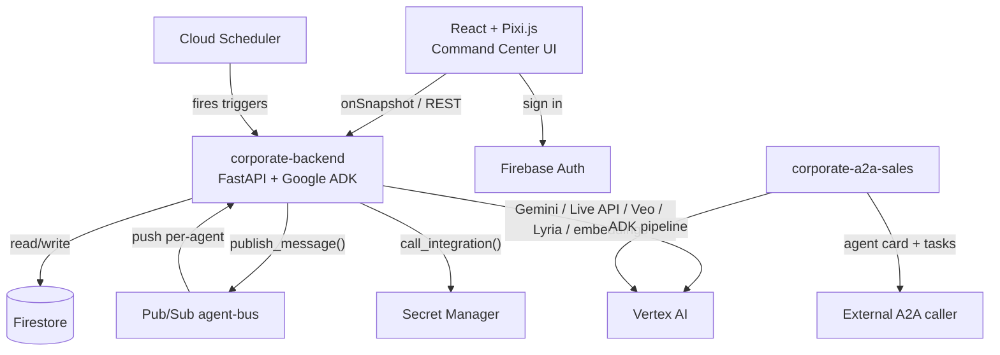

# Corporate — hackathon submission

Built for **All Things Agentic**, track: **The Fortified Enterprise Fleet**.

## Elevator pitch

A virtual company that actually runs itself: nine autonomous AI departments — Finance, Engineering, Legal, Sales, HR, Support, Marketing, Analytics, and a CEO who delegates to all of them — working on a live 2D office floor you can watch, join by voice, and audit down to the hash chain.

## Project story

### Inspiration

The Fortified Enterprise Fleet track's own description is specific: "scalable institutional agent networks" with real components for discovery/lifecycle, execution/state management, security/governance, and telemetry, emphasizing "production compliance and cross-department deployment" — not a chatbot demo with one clever prompt. That phrase, *cross-department*, is doing real work. It's asking for an organization, not an agent. A department roster of specialized agents reporting to a CEO orchestrator was the natural shape for that, because it's how a real company is already organized — "governance" and "cross-department deployment" don't have to be abstractions bolted on after the fact; they can just be the org chart, made literal. Office-style AI agent apps were an inspiration for making that org chart feel alive — a company you can actually watch working on a 2D floor — rather than another dashboard with numbers on it.

That inspiration turned into a genuinely long build, not a weekend sprint: foundational architecture decisions first (hosted vs. desktop, Firestore+Pub/Sub vs. polling, A2A scoped to the boundary only, one shared department contract), then three core departments to prove the loop worked over *real* infrastructure, then the full nine-department roster, then two full research digressions (Google Antigravity, evaluated and rejected on its own merits; a mature open-source coding agent's "loop engineering" patterns, adopted natively with zero new dependency), then a capability-expansion pass (sub-agent spawning, a real sandboxed code-execution tool, per-department integration access control), then voice/OAuth/Veo/Lyria, and finally — three days before the deadline — a hard eligibility discovery and a full production-hardening push that turned into its own saga (see Challenges, below). Every step of that is written down in [`docs/PROJECT_HISTORY.md`](docs/PROJECT_HISTORY.md) and the [blog series](docs/blog/), not reconstructed after the fact for this writeup.

### What it does

Sign in, dispatch a goal to the CEO agent, and watch it get decomposed into real tasks routed to the department best suited for each one — over an actual Pub/Sub message bus, not an in-process function call. Each department runs its own multi-stage ADK pipeline with a genuinely different shape per domain, not one template reused nine times: triage → cascade-risk assessment → postmortem draft for Engineering & SRE (with a real Slack notification on high-severity incidents); document-intelligence extraction → classification → a structurally-independent fraud-risk judgment → deterministic verification → plain-language explanation for Finance & Audit; five parallel judge lenses → deterministic quote-grounding for Legal & Risk (an ungrounded citation is dropped, never "corrected" by asking a model to fix it); classify → knowledge-base-grounded reply → the same grounding check for Customer Support; brief → copy → brand-voice checker fan-out (including an independent second Gemini call reviewing the first one's own output) → scheduling suggestion for Marketing & Comms, which can also kick off a real Veo-generated promo video alongside the copy. Every claim any department produces is either deterministically grounded against a real source, or run through a multi-checker vote before it's ever surfaced — an LLM may judge or propose, but only deterministic code verifies, the one architectural rule that shows up in more of this codebase than any other.

A Command Center dashboard — Monitor, Tasks, Ask-me, Activity, Triggers, Workers, Memory, Knowledge, Board, Graph, Settings, Commands — gives full visibility into every agent's status, mood, memory, message graph, per-aspect verification votes, and the tamper-evident hash-chained audit trail behind every task, with a live audit-chain integrity badge and a real polling service-health indicator so a dropped connection shows a banner instead of silently freezing. Agents have real, original personas (name, bio, voice, mood, sprite — no resemblance to any media property), can talk to the CEO by realtime voice over a backend-held WebSocket relay to Vertex AI's Live API, generate break-room ambient music on demand with Lyria, and propose their own skills for a human to approve or reject from the same panel that shows their built-in ones. GitHub, Slack, and Notion connect through a real OAuth "Connect with X" flow, not a pasted API token, with per-department access control and a standing approval queue for anything a department requests but isn't allowlisted for.

### How we built it

Python 3.12 + FastAPI + Google ADK 2.7.1 on the backend, one department contract (`DepartmentSpec` + `on_task_received`, wrapped automatically in `@audited_task` for hash-chained audit logging, idempotent dispatch, and failure containment) that all nine departments implement identically — a new department gets a working, governed pipeline on day one with zero of its own plumbing code. React + Vite + TypeScript + Pixi.js on the frontend, reading Firestore directly via `onSnapshot` for live state and writing through a thin REST client that attaches a Firebase ID token. Firestore holds all durable state, namespaced `orgs/{orgId}/...` from day one even with only one org ever seeded — multi-tenant by construction, not bolted on later. Pub/Sub carries every inter-agent message through exactly one chokepoint function (`publish_message()`) that owns hop-count loop prevention and `requires_reply` derivation mechanically — no LLM's own judgment ever decides whether a reply is owed. Cloud Run hosts both the main backend and a second, deliberately separate A2A server exposing only Sales & CRM externally, keeping the internal Pub/Sub fabric and the external trust boundary structurally apart.

The build order itself was deliberate, not incidental: foundations first (the five shape decisions above), then Finance & Audit alongside a minimal frontend specifically to prove the CEO-to-department loop over real Pub/Sub before building anything else on top of it, then the rest of the roster, then a hardening pass once real usage exposed real gaps (no Pub/Sub redelivery dedup, no error containment anywhere in the dispatch path, an Ask-me flow that was broken end to end because a flag was set but the entry it pointed to was never written), then a capability pass (Google Search, per-task model tiering, vision attachments via Cloud Storage instead of base64-in-Firestore), then two UI passes (the second one specifically because the user reviewed real screenshots of a reference app's running UI and found the first pass's *layout*, not just its color tokens, still didn't match), then the ADR-0016 capability expansion (sub-agent spawning reusing the existing ephemeral-worker mechanism instead of reopening the Pub/Sub-only CEO boundary; a real sandboxed `execute_python` tool — a genuine OS subprocess as the actual isolation boundary, RestrictedPython as defense-in-depth on top, not instead), then voice/OAuth/Veo/Lyria, and finally the submission push. Every non-obvious decision along the way has an ADR in `/docs/adr/` — 20 of them by the end — which is the specific discipline that made the final three-day audit (below) a tractable, if intense, few days of focused work instead of a panic: nothing had to be re-derived from scratch, because the reasoning behind every earlier call was already on record.

### Challenges we ran into

This project's honest answer to "what went wrong" is long, because the discipline throughout was to actually go looking for what was wrong rather than assume a working demo meant a working system. Roughly in the order they happened:

- **Google Antigravity, evaluated and rejected on real evidence, not vibes** (ADR-0014). Installed the actual `google-antigravity` SDK and `agy` CLI, inspected the real source with Python's `inspect`, ran it against live Vertex AI turns. Found: no pluggable persistence that survives a fresh process (the real API had none of what the docs described, and Cloud Run's ephemeral, scale-to-zero, multi-instance model can't tolerate that); the CLI's real headless auth path was a raw Gemini API key, not Vertex AI, directly conflicting with the eligibility requirement below. Let it go entirely — and the investigation surfaced something better than a workaround: department sessions already persisted across turns via the existing `FirestoreSessionService`, so the "no memory between turns" gap the whole search started from didn't actually exist.
- **Gemma turned out to be unreachable** in this project's Vertex AI access at any tier (ADR-0019). Live-testing every variant — not trusting Model Garden's own docs page — found each one's card showed only a paid, self-hosted "Deploy model" button, never the zero-deployment serverless path originally assumed; Llama, Mistral, Codestral, and Jamba were tried as replacements and 404'd the exact same way. Self-hosting a dedicated GPU endpoint for one aspect checker, this close to a deadline, was a bad trade. Swapped for a distinct Gemini tier instead — still a genuinely separate model call, fresh context, just not a different vendor, and the ADR says so plainly rather than let the "cross-model" framing quietly stay inaccurate.
- **A hard eligibility gap found three days before the deadline, by re-reading the hackathon's own rules directly instead of relying on an earlier read**: "Gemini 3.5 or newer" is required for every track; this project's default model config was still on 2.5-tier models. Fixing it needed real investigation, not a docs lookup — the 3.5-tier models 404'd at the region every other model in the project already used, which turned out to mean nothing needed fixing in the region config at all: reading `google.adk.models.google_llm.Gemini.api_client`'s own installed source showed ADK's `LlmAgent` never passes an explicit location, and `google.genai`'s own client silently defaults to Vertex's `global` endpoint whenever `GOOGLE_CLOUD_LOCATION` is unset — which it always had been. Confirmed with a real end-to-end ADK turn before committing a single line, per ADR-0020.
- **A silent production bug, found while auditing observability, that nobody had reported**: every ephemeral worker had been failing on its very first turn since the feature shipped, because `update_agent_status`'s Firestore `.update()` call assumed a document existed that a worker never gets — only registered department agents do. Reproduced live both ways (the bug with the old code, the fix with the new) against real Firestore before shipping the one-line `except NotFound: pass`.
- **Two more instances of the exact same eligibility bug, both self-inflicted, both found while live-seeding a demo org for the actual recording**: `shared/cross_model_check.py`'s independent-review checker and `app/services/compaction.py`'s session-compaction summarizer both build their own raw `genai.Client()` pinned to the old region instead of going through ADK's default resolution — meaning upgrading to Gemini 3.5 broke both of them with a 404, and broken compaction meant nothing ever trimmed the CEO's growing session, which is exactly how its own session document hit Firestore's 1MiB cap in production a few hours later. Fixed both, live-verified both.
- **Fixing that Firestore-size bug surfaced a second bug, and the first attempt at fixing *that* introduced a third**: a Google-Search-grounded turn could carry a raw SDK object nested inside its own "JSON-safe" event dump, crashing the write outright — reproduced live, the shape depends on the real search response so no single field could be special-cased. The first fix (stringify anything JSON can't encode) stopped the crash but corrupted every later *read* of that same session, since the schema expects a dict-or-`None` where it now found a bare string. The actual fix converts the offending value to `None` instead of a string, and `get_session()` now also skips (and logs) any individual historical event that still fails validation for any other reason, rather than one bad event bricking an agent's entire memory forever.
- **Break-room music was completely broken on Cloud Run, unconditionally**, independent of everything else — `generate_signed_url()` tries to sign locally with the credential's own private key by default, and Compute Engine/Cloud Run credentials (and even a local `gcloud auth application-default login` credential) have none, regardless of the `iam.serviceAccountTokenCreator` self-impersonation grant already correctly in place. Fixed by explicitly routing the signing call through the IAM Credentials `signBlob` API instead — Google's own documented pattern for exactly this scenario.
- **A promo video that said "done" but showed a blank, unplayable player**: the Veo poll endpoint was writing the raw `gs://` URI straight into the task — no browser `<video>` tag can dereference that — and never clearing the "still generating" flag on completion either. Same signed-URL fix, generalized into a small `sign_existing_gcs_uri()` helper, plus an explicit `videoGenerating: False` on completion; verified against a freshly generated video end to end, including fetching the resulting signed URL directly and confirming a real, playable `video/mp4` came back.
- **The literal last bug, found by the user clicking a button minutes before recording the demo video**: clicking "Messages" on any agent blanked the entire app to a white screen. The cause was almost embarrassingly simple once found — a message's `createdAt` field is a raw Firestore `Timestamp` *object* at runtime (an `onSnapshot` read, not a REST response, despite being typed as `string`), and rendering an object directly as a React child is an uncaught render error with no error boundary, so React unmounts everything. Three other spots (agent/task `createdAt`, a board note's `updatedAt`) had the identical bug but failed silently instead — `new Date(timestampObject)` doesn't throw, it just quietly produces "Invalid Date." All four now go through the one date-coercion helper already built for exactly this Firestore quirk, which nobody had reached for in these four call sites.
- **A registered-app config error mid-integration-setup**: connecting Slack for real hit `invalid_team_for_non_distributed_app` — a Slack-side restriction (a non-distributed app can only install into the workspace it was created under), not a bug in this project at all, resolved by using the correct workspace rather than by changing any code.

### Accomplishments that we're proud of

A dispatch path that's idempotent and fails closed by construction (a redelivered Pub/Sub message is a logged no-op; a department exception always becomes a blocked task with a human question, never a crash or a silent stall) — not bolted on, but the actual contract every department gets for free, on day one, with zero of its own code. A tamper-evident, hash-chained audit log with a live integrity badge on the Activity tab. Defense-in-depth auth, two independent layers (Firestore Security Rules and an independent backend membership check, because the backend's own elevated service-account writes aren't subject to the client-facing rules at all). Twenty ADRs and a full chronological history document that made a genuinely intense three-day pre-deadline audit tractable instead of a scramble, because no earlier decision ever had to be re-derived from scratch. And, honestly, the discipline itself: nine real, distinct production bugs (not counting the Slack workspace config issue, which wasn't a bug) were found and fixed in the final 72 hours specifically *because* the team went looking for them by live-testing against real Vertex AI, Firestore, and Cloud Storage instead of trusting that a working demo meant a working system — including one the user found by clicking a button 20 minutes before recording the actual submission video, which got fixed and redeployed before that recording happened.

### What we learned

Documentation — a package's own docstrings, a Model Garden card, a search-engine-summarized "verified" code snippet, this project's own architecture doc — lags reality more often than feels comfortable, and the fix was always the same regardless of which layer it showed up at: verify live against the actual deployed system before writing a line of config or trusting a claim, and write down what you found even when it's a correction to your own earlier decision (see ADR-0019's own "Update" section, written the same way this one is). That discipline paid for itself concretely at least nine separate times across this project, most densely in the final three days. The second, quieter lesson came from the session-corruption bug: a fix that stops a crash isn't automatically a correct fix — it's worth checking what the *other* code path (the read, not just the write) expects before shipping the first thing that makes an error message go away. And the last one, from the Slack workspace error and the Firestore-Timestamp render crash both: some of what looks like "the app is broken" is actually "the app is telling you something true about its environment or its data," and the fastest way to tell the difference is still to go look, not guess.

### What's next for Corporate

The `SequentialAgent`→ADK `Workflow` migration (deferred once already, ADR-0009, now that a stable graph-based alternative exists); real Cloud Run Job execution for ephemeral workers instead of in-process `asyncio` tasks (documented as a deliberate MVP shape from day one, not an oversight); retry-with-backoff for transient Gemini errors; self-service org invites instead of `scripts/seed.py --owner-uid`; routing realtime voice through ADK's `Runner.run_live`/`LiveRequestQueue` so a spoken request can actually call `create_task`, not just talk in character; and, given how much of the final push was "a raw SDK object leaked somewhere Firestore or the frontend couldn't handle it," a closer look at whether any other event-shaped data in this codebase has the same class of gap before the next feature finds it the same way — by breaking, live, at the worst possible time.

## Built with

`python`, `fastapi`, `google-adk`, `google-genai`, `gemini-3.5-flash`, `gemini-3.1-pro-preview`, `vertex-ai`, `firestore`, `pub-sub`, `cloud-run`, `cloud-scheduler`, `secret-manager`, `firebase-auth`, `firebase-hosting`, `react`, `vite`, `typescript`, `pixi.js`, `xterm.js`, `veo`, `lyria`, `text-embedding-004`, `a2a-protocol`, `restrictedpython`, `pydantic`, `websockets`

## Try it out

- **Live app**: https://project-f0b6b4ce-541f-43ff-9f7.web.app
- **Backend health**: https://corporate-backend-2wv6ilt7fa-uc.a.run.app/api/healthz
- **Sales & CRM A2A agent card**: https://corporate-a2a-sales-2wv6ilt7fa-uc.a.run.app/.well-known/agent-card.json
- **Source**: this repository (shared with `testing@devpost.com` and `cloudhackathons@google.com` per submission requirements)

## Detailed testing instructions

**Try it live** (fastest path): open the live app URL above, sign in with Google, and:
1. Watch the office floor — agents idle, then animate (thinking/working/blocked dots) as they get work.
2. Go to **Tasks**, or just wait — the seeded org has departments ready to receive work. Dispatch a goal through the CEO (via the Terminal in the CEO's Agent Detail view, or a Trigger).
3. Watch **Activity** for the live audit-chain integrity badge, **Ask-me** for any human-in-the-loop questions a department raises, **Graph** for the live agent-to-agent message graph, **Workers** to spawn an ephemeral one-off worker and watch its real execution trace, and **Board** for the CEO's shared company blackboard.
4. Open a department's Agent Detail view for its persona, voice, current goal, model tier, and skills (built-in, AI-proposed pending your approval, and custom).
5. Try the mic icon for a realtime voice conversation with the CEO.

**Run it locally**:
```bash
# Backend
cd backend
python -m venv .venv && .venv/Scripts/activate  # .venv/bin/activate on macOS/Linux
pip install -r requirements.txt
cp .env.example .env  # fill in your GCP project id
python scripts/seed.py --owner-uid <your-firebase-uid>
uvicorn app.main:app --reload --env-file .env

# Frontend
cd frontend
npm install
cp .env.example .env  # fill in your Firebase web app config
npm run dev
```

**Run the test suite** (no live GCP credentials needed — everything mocks Firestore/Pub-Sub/Gemini/Secret Manager):
```bash
cd backend && pytest -q          # 228+ tests
cd frontend && npm run build && npm run lint
```

Full setup detail, including Pub/Sub push-subscription setup and A2A server deployment, is in `README.md`.

## Which Google SDK did you use?

**Agent Development Kit (ADK)** (`google-adk==2.7.1`) — every agent in this project is an ADK `LlmAgent`/`SequentialAgent`/`ParallelAgent`, built by one factory module, with a Firestore-backed custom `BaseSessionService` implementation (Cloud Run instances are ephemeral; `InMemorySessionService` would silently lose context between a push-delivered agent's turns).

**Google GenAI SDK** (`google-genai==2.18.1`) — used directly (not just through ADK) for the realtime voice relay (`client.aio.live.connect()`), Veo video generation, and Lyria music generation.

## Which Google Cloud Service(s) did you use?

**Cloud Run** (two services: the main backend, and a separate A2A server for Sales & CRM), **Firestore** (all durable state), **Pub/Sub** (the entire inter-agent message bus), **Cloud Scheduler** (schedule-type triggers, including the CEO's own autonomous self-check and memory-curation triggers), **Secret Manager** (every third-party credential), plus **Firebase Auth** and **Firebase Hosting**.

## Architecture diagram

See `docs/ARCHITECTURE.md` for the full diagram and component breakdown. Summary:



## Which Google AI Models did you use?

**Gemini 3.5 Flash** (default reasoning tier, every department), **Gemini 3.1 Pro Preview** (escalated "pro" tier — 3.5 Pro has no public model id yet, so this is the current frontier Pro-tier model instead; see ADR-0020 for why that's not claimed as itself satisfying the 3.5+ requirement), **Gemini 3.5 Flash-Lite** (independent-review verifier — a genuinely separate model call, fresh context, checking another Gemini call's own output), **`gemini-live-2.5-flash-native-audio`** (realtime voice), **`text-embedding-004`** (semantic memory search), **Veo 3.1** (promo video generation), **Lyria 002** (break-room music generation). Gemma was evaluated for the independent-review tier (ADR-0019) and found unreachable in this project's Vertex AI access at any tier — an honest miss, not hidden.

## Track fit and an honest read on our chances

**Why Fortified Enterprise Fleet**: the track wants discovery/lifecycle (department contract + scaffolding skill), execution/state (Firestore-backed sessions, idempotent Pub/Sub dispatch), security/governance (Firestore rules + backend membership check independently, per-department integration access control with a standing approval queue, Secret Manager as the only place a credential is ever real), and telemetry (the audit hash chain, per-aspect verification votes, live service-health indicators) — this project's actual architecture, not a demo dressed up to sound like it fits.

**Against the judging weights**: Innovation & Operational Utility (40%) — nine real department pipelines doing genuinely different work (deterministic fraud scoring, quote-grounded legal/support answers, brand-voice-checked marketing copy), not one prompt template reused nine times. Architectural Discipline & Tech Stack (30%) — 20 ADRs, a single department contract every one of the nine follows, defense-in-depth auth, and (honestly) nine separate real bugs caught and fixed by live-testing in the final 72 hours (see Challenges, above) that would otherwise have shipped broken, non-compliant, or both. Demo & Production Readiness (30%) — actually deployed and live on Cloud Run/Firebase, not just runnable locally, with a real service-health indicator and connection-loss handling in the UI itself.

**Real weaknesses, not glossed over**: no live user load ever tested against this (a hackathon demo, not a production SLA); a small, fast-moving build with corners genuinely deferred (`SequentialAgent`, in-process worker execution) and documented as such rather than hidden; some of the observability work (per-aspect votes, worker trace, the audit badge) landed in the final 72 hours, which is a real timing risk even though it's tested and live.
